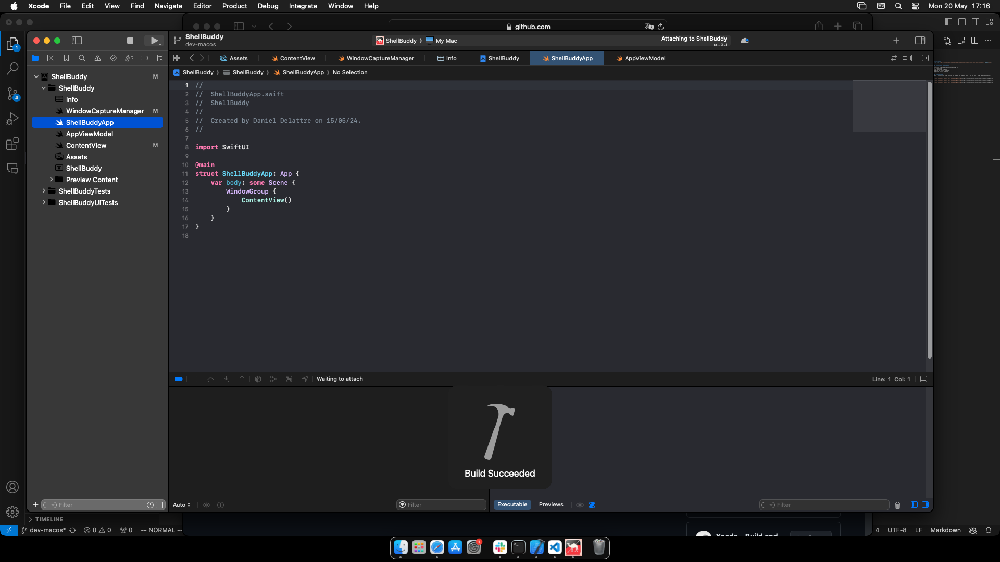
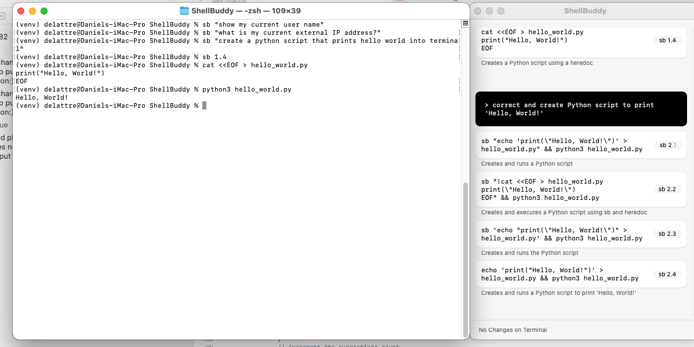
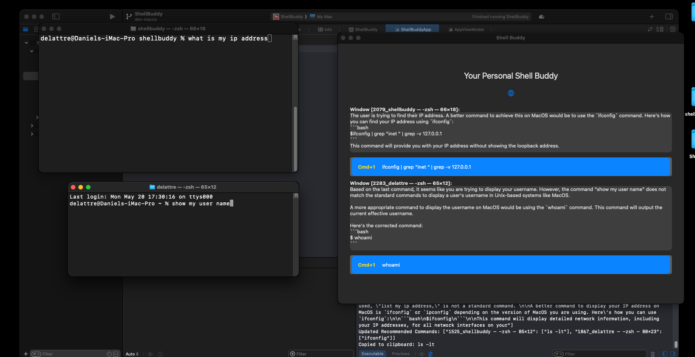

# ShellBuddy


## Installation Instructions
```bash
git clone git@github.com:srosro/shellbuddy.git
```

Open the project in Xcode, build it, and then you will be able to run it.

## Build in Xcode


## Example Usage
Open a new terminal (side by side) and work as you normally would. You now have a buddy offering you tips :)



