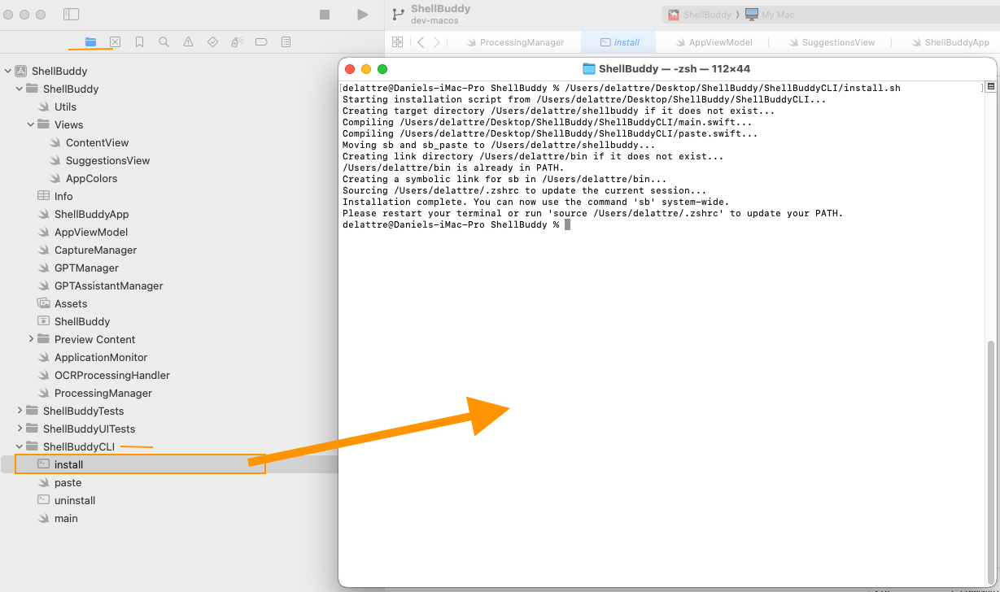

# ShellBuddy


## Installation Instructions
```bash
git clone git@github.com:srosro/shellbuddy.git
```

Open the project in Xcode, build it, and then you will be able to run it.

### Easy Installation Script
1. Open the project in Xcode and locate the `install.sh` script under `ShellBuddyCLI`.
2. Open your terminal.
3. Drag and drop the `install.sh` script from Xcode into the terminal 
4. Press `Enter` to run the script. It will handle the installation process automatically.

   ```sh
   Starting installation script from /path/to/ShellBuddyCLI/install.sh...
   Installation complete. You can now use the command 'sb' system-wide.
   ```

5. If `sb` command doesn’t work immediately, run:
   ```sh
   source ~/.zshrc
   ```

## Setting Up OPENAI_API_KEY in Xcode
To integrate OpenAI API calls in ShellBuddy, you need to set up an `OPENAI_API_KEY` environment variable in Xcode. Follow these steps:

1. In Xcode, navigate to the top menu and click on `Product`.
2. Select `Scheme` then `Edit Scheme`.
3. In the sidebar of the scheme editor, select `Run`.
4. Go to the `Arguments` tab.
5. Under `Environment Variables`, click the `+` button to add a new variable.
6. Enter `OPENAI_API_KEY` as the name and your OpenAI API key as the value.
7. Close the scheme editor to save your changes.

## Build in Xcode


## Example Usage
Open a new terminal and work as you normally would. You now have a buddy offering you tips :)


By following these instructions, you can securely incorporate the OpenAI API into your Xcode project, enabling ShellBuddy to utilize AI capabilities.