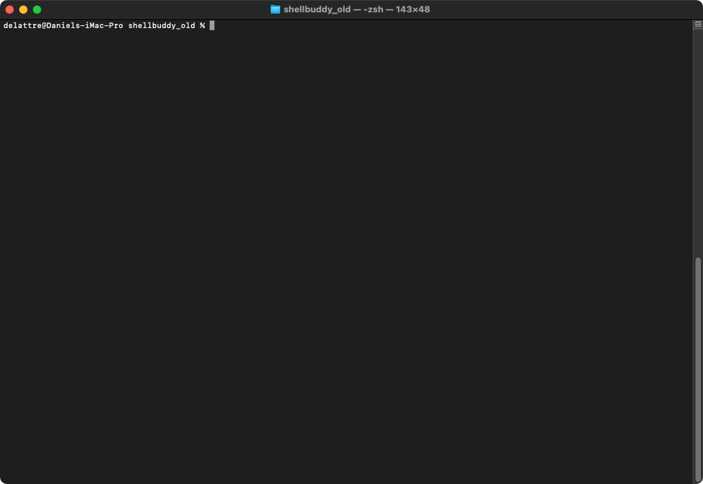
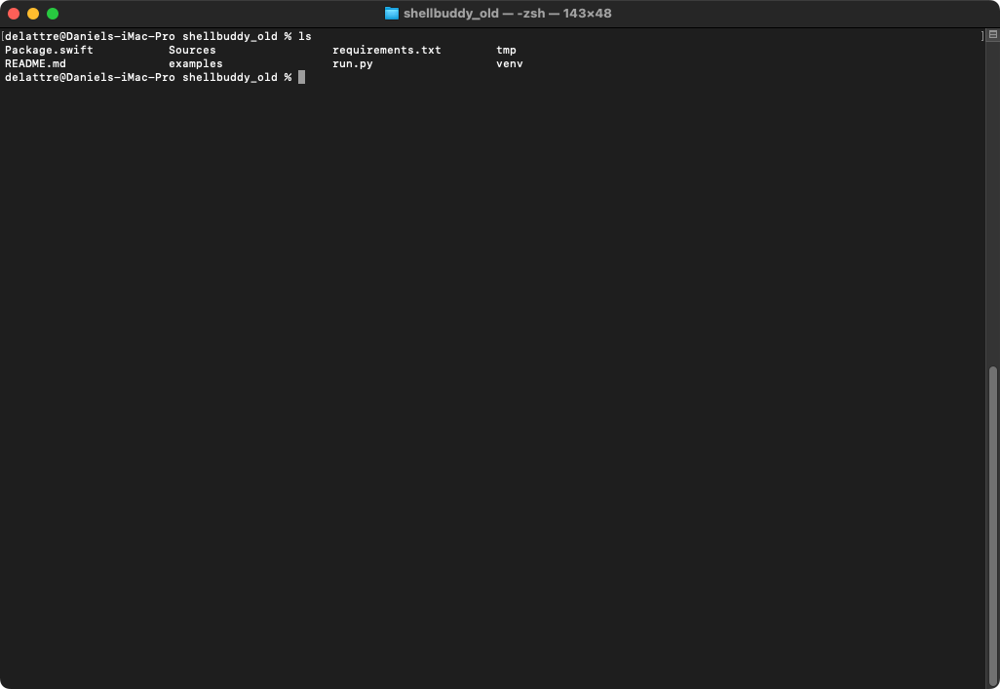
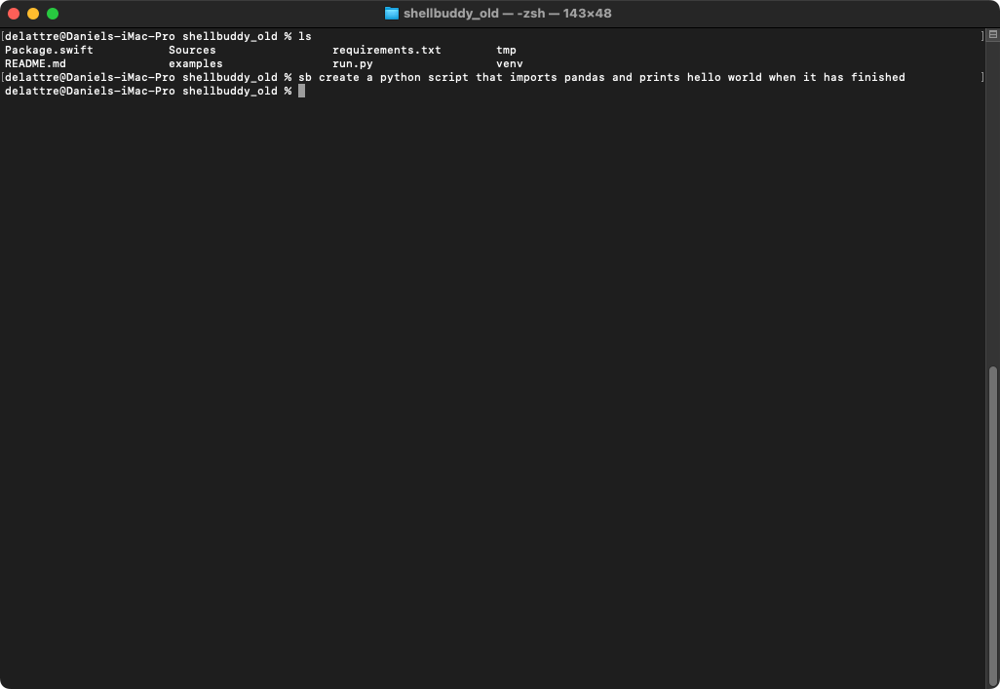
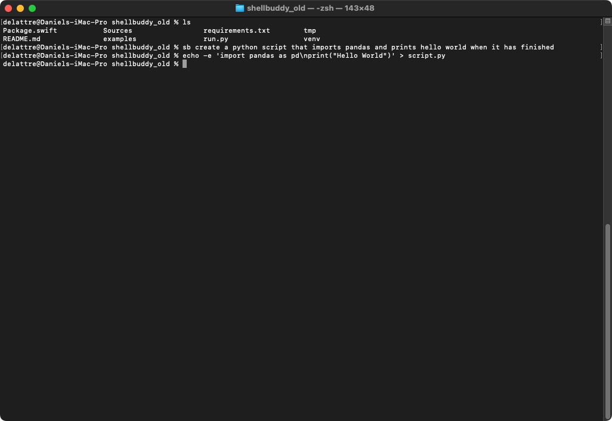
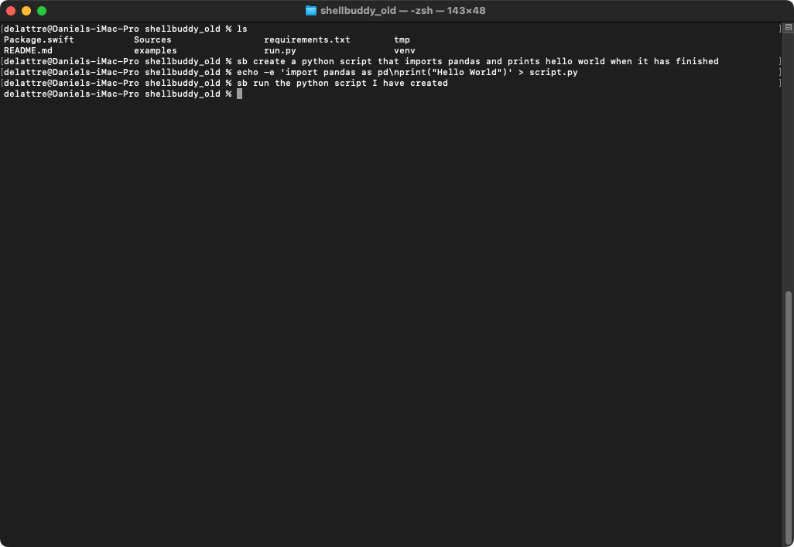
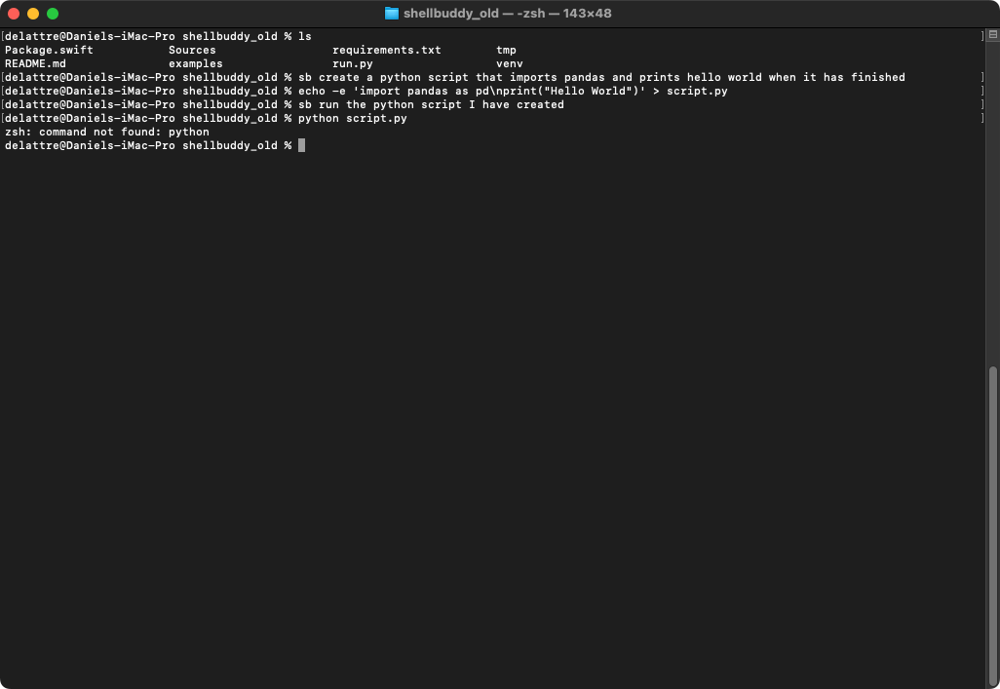
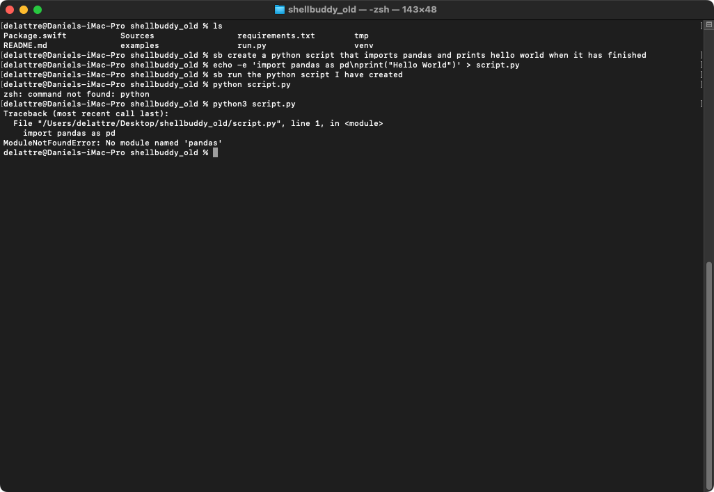
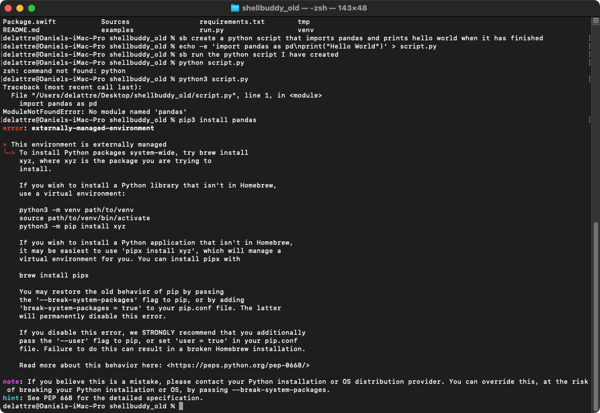
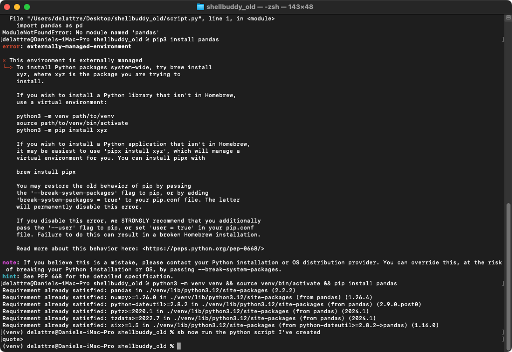
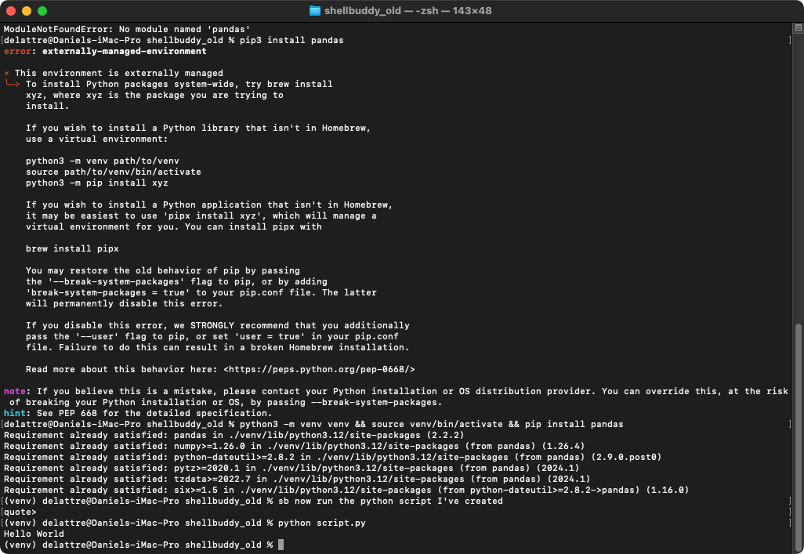

# Image Processing Report

## Image: 1.png



**Extracted Text:**

```json
{
    "highlighted": "",
    "history": [],
    "messagesToAssistant": {
        "sbMessages": ""
    },
    "mostRecent": {
        "item": ""
    }
}
```

**AI Response:**

```json
{
    "intention": "No command provided",
    "command": ""
}
```

## Image: 2.png



**Extracted Text:**

```json
{
    "highlighted": "ls\nPackage.swift Sources requirements.txt tmp\nREADME.md examples run.py venv",
    "history": [
        {
            "command": "ls",
            "output": "Package.swift Sources requirements.txt tmp\nREADME.md examples run.py venv"
        }
    ],
    "messagesToAssistant": {
        "sbMessages": ""
    },
    "mostRecent": {
        "item": "ls"
    }
}
```

**AI Response:**

```json
{
    "intention": "list files in detail",
    "command": "ls -l"
}
```

## Image: 3.png



**Extracted Text:**

```json
{
    "highlighted": "",
    "history": [
        {
            "command": "ls",
            "output": "Package.swift     Sources          requirements.txt tmp\nREADME.md        examples         run.py            venv"
        },
        {
            "command": "sb create a python script that imports pandas and prints hello world when it has finished",
            "output": ""
        }
    ],
    "messagesToAssistant": {
        "sbMessages": "sb create a python script that imports pandas and prints hello world when it has finished"
    },
    "mostRecent": {
        "item": "sb create a python script that imports pandas and prints hello world when it has finished"
    }
}
```

**AI Response:**

```json
{
    "intention": "create a Python script",
    "command": "echo -e 'import pandas as pd\\nprint(\"Hello, world!\")' > script.py"
}
```

## Image: 4.png



**Extracted Text:**

```json
{
    "highlighted": "",
    "history": [
        {
            "command": "ls",
            "output": "Package.swift\tSources\trequirements.txt\ttmp\nREADME.md\texamples\trun.py\tvenv"
        },
        {
            "command": "sb create a python script that imports pandas and prints hello world when it has finished",
            "output": ""
        },
        {
            "command": "echo -e 'import pandas as pd\\nprint(\"Hello World\")' > script.py",
            "output": ""
        }
    ],
    "messagesToAssistant": {
        "sbMessages": "sb create a python script that imports pandas and prints hello world when it has finished"
    },
    "mostRecent": {
        "item": "echo -e 'import pandas as pd\\nprint(\"Hello World\")' > script.py"
    }
}
```

**AI Response:**

```json
{
    "intention": "run the created Python script",
    "command": "python3 script.py"
}
```

## Image: 5.png



**Extracted Text:**

```json
{
    "highlighted": "None",
    "history": [
        {
            "command": "ls",
            "output": "Package.swift     Sources     requirements.txt   tmp\nREADME.md         examples    run.py             venv"
        },
        {
            "command": "sb create a python script that imports pandas and prints hello world when it has finished",
            "output": ""
        },
        {
            "command": "echo -e 'import pandas as pd\\nprint(\"Hello World\")' > script.py",
            "output": ""
        },
        {
            "command": "sb run the python script I have created",
            "output": ""
        }
    ],
    "messagesToAssistant": {
        "sbMessages": [
            "sb create a python script that imports pandas and prints hello world when it has finished",
            "sb run the python script I have created"
        ]
    },
    "mostRecent": {
        "item": "sb run the python script I have created"
    }
}
```

**AI Response:**

```json
{
    "intention": "run the created Python script",
    "command": "python3 script.py"
}
```

## Image: 6.png



**Extracted Text:**

```json
{
    "highlighted": "",
    "history": [
        {
            "command": "ls",
            "output": "Package.swift   Sources        README.md      examples       requirements.txt  run.py         tmp            venv"
        },
        {
            "command": "sb create a python script that imports pandas and prints hello world when it has finished",
            "output": ""
        },
        {
            "command": "echo -e 'import pandas as pd\\nprint(\"Hello World\")' > script.py",
            "output": ""
        },
        {
            "command": "sb run the python script I have created",
            "output": ""
        },
        {
            "command": "python script.py",
            "output": "zsh: command not found: python"
        }
    ],
    "messagesToAssistant": {
        "sbMessages": [
            "sb create a python script that imports pandas and prints hello world when it has finished",
            "sb run the python script I have created"
        ]
    },
    "mostRecent": {
        "item": "zsh: command not found: python"
    }
}
```

**AI Response:**

```json
{
    "intention": "correct and run the Python script",
    "command": "python3 script.py"
}
```

## Image: 7.png



**Extracted Text:**

```json
{
    "highlighted": null,
    "history": [
        {
            "command": "ls",
            "output": "Package.swift Sources requirements.txt tmp README.md examples run.py venv"
        },
        {
            "command": "sb create a python script that imports pandas and prints hello world when it has finished",
            "output": ""
        },
        {
            "command": "echo -e 'import pandas as pd\\nprint(\"Hello World\")' > script.py",
            "output": ""
        },
        {
            "command": "sb run the python script I have created",
            "output": ""
        },
        {
            "command": "python script.py",
            "output": "zsh: command not found: python"
        },
        {
            "command": "python3 script.py",
            "output": "Traceback (most recent call last):\n  File \"/Users/delattre/Desktop/shellbuddy_old/script.py\", line 1, in <module>\n    import pandas as pd\nModuleNotFoundError: No module named 'pandas'"
        }
    ],
    "messagesToAssistant": {
        "sbMessages": [
            "sb create a python script that imports pandas and prints hello world when it has finished",
            "sb run the python script I have created"
        ]
    },
    "mostRecent": {
        "item": "delattre@Daniels-iMac-Pro shellbuddy_old % ModuleNotFoundError: No module named 'pandas'"
    }
}
```

**AI Response:**

```json
{
    "intention": "install pandas package",
    "command": "pip3 install pandas"
}
```

## Image: 8.png



**Extracted Text:**

```json
{
    "highlighted": "python script.py",
    "history": [
        {
            "command": "create a python script that imports pandas and prints hello world when it has finished",
            "output": ""
        },
        {
            "command": "echo -e 'import pandas as pd\\nprint(\"Hello World\")' > script.py",
            "output": ""
        },
        {
            "command": "sb run the python script I have created",
            "output": ""
        },
        {
            "command": "python script.py",
            "output": "zsh: command not found: python"
        },
        {
            "command": "python3 script.py",
            "output": "Traceback (most recent call last):\n  File \"/Users/delattre/Desktop/shellbuddy_old/script.py\", line 1, in <module>\n    import pandas as pd\nModuleNotFoundError: No module named 'pandas'"
        },
        {
            "command": "pip3 install pandas",
            "output": "error: externally-managed-environment\n\nThis environment is externally managed\nTo install Python packages system-wide, try brew install xyz, where xyz is the package you are trying to install.\n\nIf you wish to install a Python library that isn't in Homebrew, use a virtual environment:\n\npython3 -m venv path/to/venv\nsource path/to/venv/bin/activate\npython3 -m pip install xyz\n\nIf you wish to install a Python application that isn't in Homebrew, it may be easiest to use 'pipx install xyz', which will manage a virtual environment for you. You can install pipx with\n\nbrew install pipx\n\nYou may restore the old behavior of pip by passing the '--break-system-packages' flag to pip, or by adding 'break-system-packages = true' to your pip.conf file. The latter will permanently disable this error.\n\nIf you disable this error, we STRONGLY recommend that you additionally pass the '--user' flag to pip, or set 'user = true' in your pip.conf file. Failure to do this can result in a broken Homebrew installation.\n\nRead more about this behavior here: <https://peps.python.org/pep-0668/>\n\nnote: If you believe this is a mistake, please contact your Python installation or OS distribution provider. You can override this, at the risk of breaking your Python installation or OS, by passing --break-system-packages.\nhint: See PEP 668 for the detailed specifications."
        }
    ],
    "messagesToAssistant": {
        "sbMessages": "sb run the python script I have created"
    },
    "mostRecent": {
        "item": "pip3 install pandas"
    }
}
```

**AI Response:**

```json
{
    "intention": "create and activate a virtual environment, then install pandas",
    "command": "python3 -m venv venv && source venv/bin/activate && pip install pandas"
}
```

## Image: 9.png



**Extracted Text:**

```json
null
```

**AI Response:**

```json
{
    "intention": "No command provided",
    "command": ""
}
```

## Image: 10.png



**Extracted Text:**

```json
{
    "highlighted": "error: externally-managed-environment",
    "history": [
        {
            "command": "pip3 install pandas",
            "output": "ModuleNotFoundError: No module named 'pandas'\nerror: externally-managed-environment\n\nThis environment is externally managed\nTo install Python packages system-wide, try brew install xyz, where xyz is the package you are trying to install.\n\nIf you wish to install a Python library that isn't in Homebrew, use a virtual environment:\n\npython3 -m venv path/to/venv\nsource path/to/venv/bin/activate\npython3 -m pip install xyz\n\nIf you wish to install a Python application that isn't in Homebrew, it may be easiest to use 'pipx install xyz', which will manage a virtual environment for you. You can install pipx with\n\nbrew install pipx\n\nYou may restore the old behavior of pip by passing the '--break-system-packages' flag to pip, or by adding 'break-system-packages = true' to your pip.conf file. The latter will permanently disable this error.\n\nIf you disable this error, we STRONGLY recommend that you additionally pass the '--user' flag to pip, or set 'user = true' in your pip.conf file. Failure to do this can result in a broken Homebrew installation.\n\nRead more about this behavior here: <https://peps.python.org/pep-0668/>\n\nnote: If you believe this is a mistake, please contact your Python installation or OS distribution provider. You can override this, at the risk of breaking your Python installation or OS, by passing --break-system-packages.\nhint: See PEP 668 for the detailed specification."
        },
        {
            "command": "python3 -m venv venv && source venv/bin/activate && pip install pandas",
            "output": "Requirement already satisfied: pandas in ./venv/lib/python3.12/site-packages (2.2.2)\nRequirement already satisfied: numpy>=1.26.0 in ./venv/lib/python3.12/site-packages (from pandas) (1.26.4)\nRequirement already satisfied: python-dateutil>=2.8.2 in ./venv/lib/python3.12/site-packages (from pandas) (2.8.2)\nRequirement already satisfied: pytz>=2020.1 in ./venv/lib/python3.12/site-packages (from pandas) (2024.1)\nRequirement already satisfied: tzdata>=2022.7 in ./venv/lib/python3.12/site-packages (from pandas) (2023.3)\nRequirement already satisfied: six>=1.5 in ./venv/lib/python3.12/site-packages (from python-dateutil>=2.8.2->pandas) (1.16.0)"
        },
        {
            "command": "python script.py",
            "output": "Hello world"
        }
    ],
    "messagesToAssistant": {
        "sbMessages": "sb run new the python script I've created"
    },
    "mostRecent": {
        "item": "python script.py\nHello world"
    }
}
```

**AI Response:**

```json
{
    "intention": "run the Python script in the virtual environment",
    "command": "source venv/bin/activate && python script.py"
}
```

